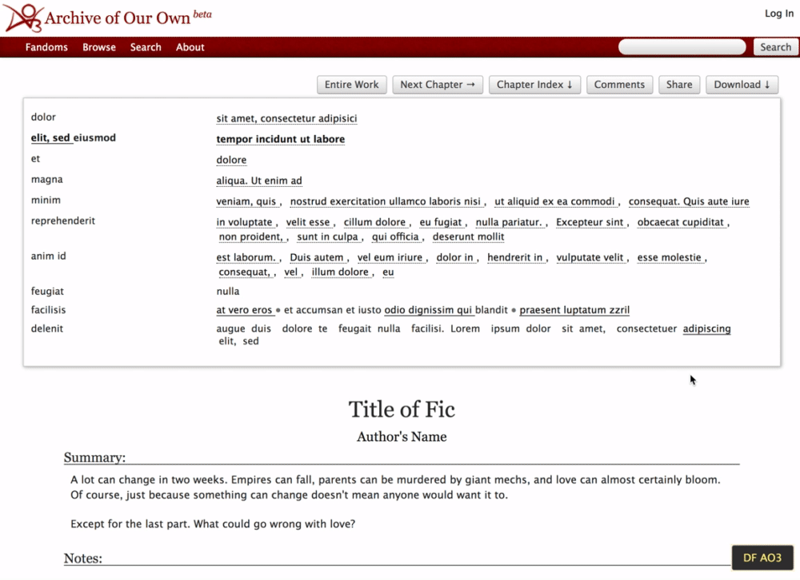

# Distraction Free AO3

Was being a huge nerd this weekend, trying to read fanfiction on AO3, but *could not* deal with the UI. Made a little obnoxious visual injection for a distraction free" reading experience.

This will probably be useless for anyone else but AO3's ui put me in a mood `¯\_(ツ)_/¯`

## What it do baby

### Here's what it do:

- Adds a button on the bottom left corner of "works" pages to enable/disable the visual injection
- Yeets everything on the page except for the actual story and important stuff
- Hides chapter summary & notes section with option to toggle
- Currently has a dark theme for the thirsty nerds reading smut in the dead of night

---

## How to use

You need to use your favourite JS/CSS injection plugin for your favourite browser and source the content of [js.js](js.js) and [css.css](css.css) files

### Using User JavaScript and CSS Plugin

1. Install [User JavaScript and CSS](https://chrome.google.com/webstore/detail/user-javascript-and-css/nbhcbdghjpllgmfilhnhkllmkecfmpld?hl=en) for Chrome
    * Only tested on here so that's recommended
2. Click the plugin and "Add new Site"
3. Add a name. It can be whatever. (ie, "Distraction Free AO3 - Dark Mode")
4. For the URL add `https://archiveofourown.org/works/*/`. This is what tells it to only enables the plugin in actual story pages
5. For Settings, check off:
   * Enabled
   * Highest CSS Priority
   * JavaScript
   * CSS
   * jQuery
6. Copy contents of [js.js](js.js) and paste it in the JS pane (left side)
7. Copy contents of [css.css](css.css) and paste in in the CSS pane (right side)
8. Click Save

This should now show up in your script list, where you can toggle it on off. If on, the button to enable the plugin will show up on the works pages.

### UserScript Managers

You can also add it via your favourite user script manager like TamperMonkey or GreaseMonkey

